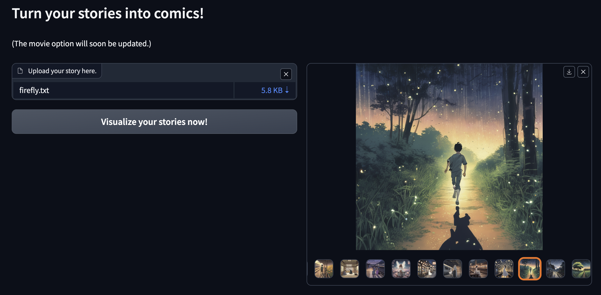

# LLM-Story
<p align="center">
  
</p>


## 🕹 Usage
### Gradio Interface
Directly uploading your story file and get the generated images/videos:
```bash
gradio app_test.py
```
If you have obtained parsed storyboard and summary script, you can run them with:
```bash
gradio app.py
```

### Collected Stories and Results
Parsed storyboard scripts locate in `./results`.

Copyright-free stories (special thanks to the Gutenberg Project) locate in `./scraping`, we have collected hundreds of different-length stories ranging from: fairy tales, romance, fantasy, literary, horror, detective fiction, science fiction.

(Notice the flash-fiction are only for test use.) This effort is ongoing and we will focusing on generating best-quality scripts and the derived images.


### (Optional) Command Line Jobs
<!-- A stable version is at `run-gpt.py`. Below is an example command, and you may upload your own story (defaul path is `./stories`) and check the Python file for customized arguments.
```bash
python3.10 run_gpt.py
```
An advanced yet in development version is at `run_infinite.py`. -->
Get the text files for storyboard and summary! We support infinite length of stories. You may also check `./notebook/demo-infinite.ipynb` for an high-level overview.
```bash
python3.10 run_infinite.py -sp ./scraping/flash-fiction-library/horror -rp ./results/flash-fiction-library/horror -sv -sn the-dream-eater
```
Check the bash template as well.
```bash
chmod +x ./scripts/flashlib-fantasy.sh
./scripts/flashlib-fantasy.sh
```
Generating images/videos using SDXL.
```bash
python3.10 run_story_to_image.py
```

## 🕹 Setup
```bash
# (Optional) Create a conda virtual environment and activate it
conda create --name story python=3.10
conda activate story

# Install the packages
pip install -r requirements.txt

# Export your OpenAI API key
export OPENAI_API_KEY=<insert your OpenAI API key>

# We also support a most open-source language models
# hosted on huggingface using the vllm interface.
```

<!-- ### (Images/Videos) Comics Generation -->
<!-- If you have obtained parsed storyboard and summary script, you can run:
```bash
gradio app.py
```
We will soon updating this so that you can run with a single story txt file. -->

<!-- For now, we directly use the huggingface tools for image/video generation.
```bash
python3.10 run_story_to_image.py
``` -->


## 🕹 Introduction
This repository is for automatically generating high-quality summary (for characters and environments) and storyboard script for any-length story files, ultimately for the adaptations across multiple media formats, such as films and animation. The codes are structured as follows:
- `./run.py`: a compact file to generate the summary and storyboard script for any given file.
- `./prompts/`: the directory for crafted prompts serving different purposes, including instructions and demonstrations.
- `./results`: the directory for saving results.
- `./scraping`: the directory for stories that scraped from different flash fictions.
    - The categories include fantasy, horror, romance, sci-fi, classic, humor, literary.

Currently, the methodology is:
- Use the `refine chain` to generate the summary for characters and environments, which works by looping over story chunks and iteratively update the results as new contexts become available.
- Use the `map reduce chain` to generate the storyboard; in this case, each chunk of story is independently visited along with the previously generated summary by the agent; a vector database may be connected for smoother generation.


## 🕹 Tasks (to be refined as a detailed doc)
Major and mid-term goal: Improving the quality of the generated scripts and the derived prompts.

- [ ] Scraping for more stories with different varieties.
- [ ] Refining prompt engineering.
    - Pre-prompt engineering: few-shot demonstrations, instructions, reasoning techniques
    - Post-prompt engineering: designing critiques.
    - The consistency issue.
- [ ] Improving the parallel part with memory modules.
- [ ] Refining the gradio with stable video diffusion.
- [ ] Finetuning open-source llm models.
    - Collecting high-quality datasets.
    <!-- - [ ] Demonstrations for few-shot illustration with expert exemplars.
        - This is essential to improve the story performance. -->
    <!-- - [PromptBase](https://promptbase.com/)
    - Reddit
    - [PromptHero](https://prompthero.com/) -->
<!-- - [ ] Making this as an agents; adding critics to improve writing -->
